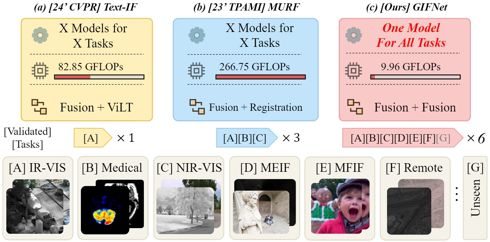

<div align="center">
  
  <p>Fig. Supporting single-modality tasks, the adopted low-level interaction between fusion tasks advances the learning of task-agnostic image features, leading to more generalised and efficient image fusion. </p>
</div>

## 1 GIFNet
This is the offical implementation for the paper titled "One Model for ALL: Low-Level Task Interaction Is a Key to Task-Agnostic Image Fusion".

Paper (Currently unavailable)

## 2 Environment
```
python 3.8.1
opencv-python 4.9.0.80
torch 2.3.0
matplotlib 3.7.5
```

## 3 Usage
To quickly test our GIFNet on the seen and unsee image fusion tasks, please run the following prompt:

```
python demo.py
```

## 4 Announcement
- 2025-02-27 This paper has been accepted by CVPR 2025.

## 5 Highlight

- **Collaborative Training**: Uniquely demonstrates that collaborative training between low-level fusion tasks yields significant performance improvements by leveraging cross-task synergies.
- **Bridging the Domain Gap**: Introduces a reconstruction task and an augmented RGB-focused joint dataset to improve feature alignment and facilitate effective cross-task collaboration, enhancing model robustness.
- **Versatility**: Advances versatility over multi-task fusion methods by reducing computational costs and eliminating the need for task-specific adaptation.
- **Single-Modality Enhancement**: Pioneers the integration of image fusion with single-modality enhancement, broadening the flexibility and adaptability of fusion models.

### 7 Citation
If this work is helpful to you, please cite it as:
```
@inproceedings{cheng2025gifnet,
  title={One Model for ALL: Low-Level Task Interaction Is a Key to Task-Agnostic Image Fusion},
  author={Cheng, Chunyang and Xu, Tianyang and Feng, Zhenhua and Wu, Xiaojun and Tang, Zhangyong and Li, Hui and Zhang, Zeyang and Atito, Sara and Awais, Muhammad and Kittler, Josef},
  booktitle={Proceedings of the IEEE/CVF Conference on Computer Vision and Pattern Recognition (CVPR)},
  year={2025}
}
```
