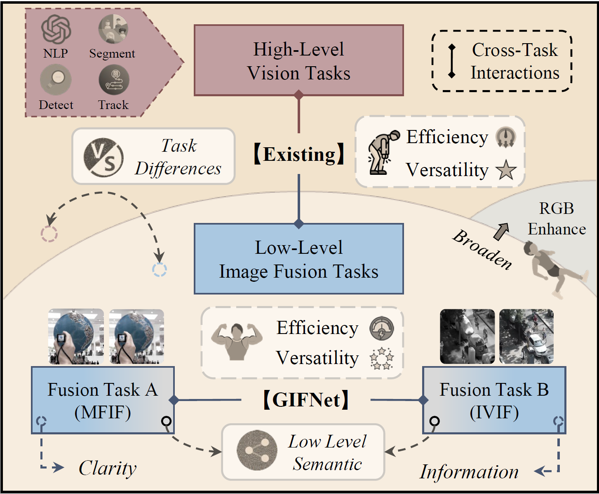

# GIFNet

#### Thank you very much for the time devoted to handling and reviewing our work.

## Highlight

- **Collaborative Training**: Uniquely demonstrates that collaborative training between low-level fusion tasks yields significant performance improvements by leveraging cross-task synergies.
- **Bridging the Domain Gap**: Introduces a reconstruction task and an augmented RGB-focused joint dataset to improve feature alignment and facilitate effective cross-task collaboration, enhancing model robustness.
- **Efficiency and Versatility**: Advances efficiency and versatility over multi-task fusion methods by reducing computational costs and eliminating the need for task-specific adaptation.
- **Single-Modality Enhancement**: Pioneers the integration of image fusion with single-modality enhancement, broadening the flexibility and adaptability of fusion models.

<div align="center">
  
  <p>Fig. 1: Supporting single-modality tasks, the adopted low-level interaction between fusion tasks advances the learning of task-independent image features, leading to more generalised and efficient image fusion. </p>
</div>

## Environment
```
python 3.8.1
opencv-python 4.9.0.80
torch 2.3.0
matplotlib 3.7.5
```

## Usage
To quickly test our GIFNet on the seen and unsee image fusion tasks, please run the following prompt:

```
python demo.py
```
