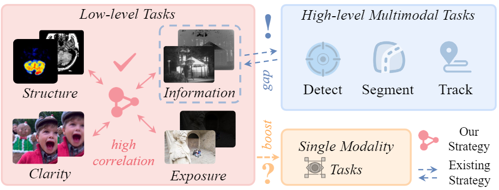

# GIFNet
Thank you very much for the time devoted to handling and reviewing our work.

## Highlight
- Without high-level semantics, the interaction of fusion tasks is established to obtain excelent performance.
- (task-independent) The cross-fusion gating mechanism and a shared reconstruction task are introduced to deliver robust generalisation capability. 
- (input-flexible) The first investigation regarding of image fusion for the single modality vision task. 

<div align="center">
  
  <p>"Using the cross-task interaction of different fusion tasks to extract the task-indepent features is one of our motivations."</p>
</div>

To quickly test our GIFNet on the seen and unsee image fusion tasks, please run the following prompt:

## Usage
```
python demo.py
```
