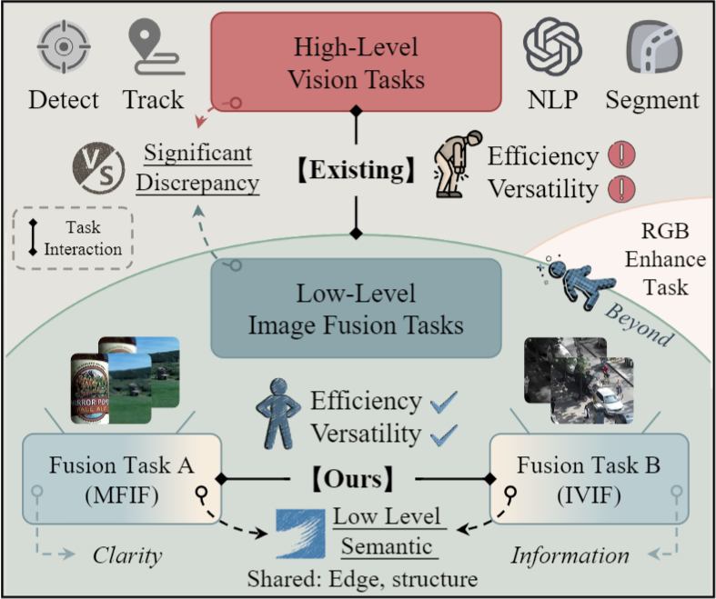

# GIFNet
Thank you very much for the time devoted to handling and reviewing our work.

## Highlight
- (Concise model) Without high-level semantics, image fusion tasks interaction is established to achieve excelent performance.
- (Task-independent) The GIFNet has been validated on six image fusion tasks.
- (Input-flexible) The first investigation regarding the application of image fusion for the single modality vision task.

<div align="center">
  
  <p>"Using the cross-task interaction of different fusion tasks to extract the task-indepent features is one of our motivations."</p>
</div>

To quickly test our GIFNet on the seen and unsee image fusion tasks, please run the following prompt:

## Usage
```
python demo.py
```
